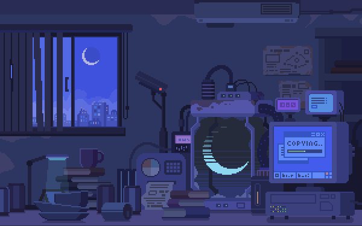

<!--# 👋 Hi there, I'm Sai Srujan Reddy !-->

  

<h1 align="center">Hi 👋, I'm Sai Srujan Reddy</h1>
<h3 align="center">CTF Player | Full Stack Developer | Web Security Researcher </h3>

 

Welcome to my GitHub profile! 
I'm a passionate [CTF player](https://ctftime.org/user/176882) with love for Cybersecurity. I am part of team bi0s which is ranked number Top 10 in the world and number 1 in India as per [CTFtime](https://ctftime.org/team/662).
Here you'll find some of my personal<!-- and collaborative--> projects.

## 🚀 About Me

- 🎓 I am currently pursuing B.Tech in CSE from Amrita Vishwa Vidyapeetham University.
- 🌱 I’m currently learning topics related to Full Stack Development, Web Exploitation and OSINT.
- 👯 I’m looking to collaborate on awesome open source projects and web exploitation tools creation projects.
- 💬 Ask me about Web exploitation, Full Stack Development.
- 📫 How to reach me: srujansaireddy.p@gmail.com
- 😄 Pronouns: He/Him
- ⚡ Fun fact: I am Ir0nw0lf3000!

## 🛠 My Stack

### Languages

### Frameworks and Libraries

<!---->

### Databases

### DevOps

<!---->

### Tools

## 📈 GitHub Stats

## 📊 Top Languages

## 📚 Latest Blog Posts
<!-- BLOG-POST-LIST:START -->

<!-- BLOG-POST-LIST:END -->

➡️ [More blog posts...](https://medium.com/@srujansaireddy.p)

## 🏆 Achievements

- 🥇 Semi-Finalist in spUN Highschool International Debates 2023 conducted by (NSS) National Space society in affiliation with NASA.
- 🥈 Finalist Weird Chess Conducted by Shaastra 24,IIT Madras.
- 🥉 3rd place in Shunya Aarambha CTF Finale 2024 , CTF conducted by Team ncreeps, a passionate-cybersecurity team from MIT-ADT Campus, Pune.
-    10th Place Shunya Aarambha CTF 24 Qualifiers.
-    10th Place Vishwa CTF 24
<!-- - 🥉 [Achievement 3]-->

## 📂 Projects
- [Stay Tuned...](https://github.com/) 

### 📌 Featured Project

---

⭐️ Don't forget to give the project a star if you found it useful!

<!--### 🗂️ Other Projects

- [Project 1](https://github.com/SaiSrujanReddyP/): 
<!-- - [Project 2](https://github.com/SaiSrujanReddyP/): Brief description - [Project 3](https://github.com/SaiSrujanReddyP/): Brief description-->

## 🔗 Connect with Me

## ☕️ Support

If you like my work, you can buy me a coffee!

---

⭐️ From [SaiSrujanReddyP](https://github.com/SaiSrujanReddyP)

---

 

